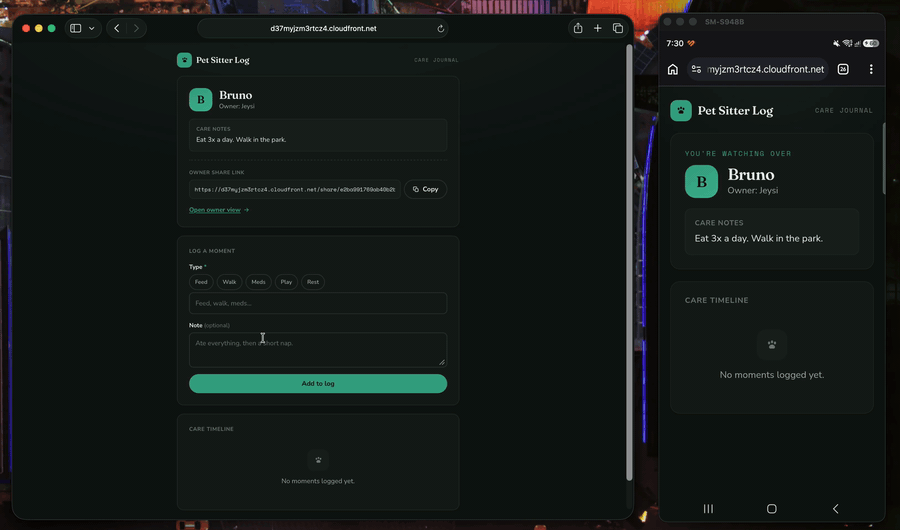
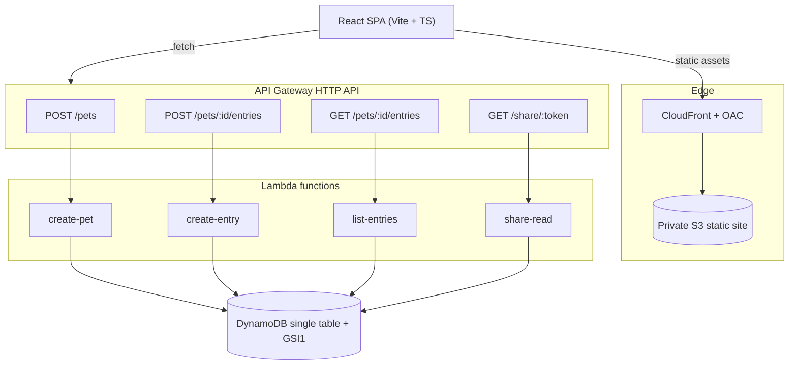

# Pet Sitter Log

A cloud-synced daily care log for pet sitters. A **sitter** logs walks, meals, meds, and notes for a client's pet; the **owner** opens a private link on their own phone and watches the day unfold, no account, no login, no app install.

**Live:** https://d37myjzm3rtcz4.cloudfront.net
**Stack:** AWS CDK · Lambda · API Gateway · DynamoDB · S3 + CloudFront · GitHub Actions (OIDC)

<!-- Replace with the two-device demo capture -->


## What it does

The whole product is one flow:

> A sitter adds an entry on their device. The owner, holding only a share link, opens it on another device and sees it.

That cross-device sync is the point. The owner's link carries a single random token and nothing else: no pet id, no credentials. The token resolves server-side to the pet and its care timeline.

## Architecture



Everything (table, functions, routes, IAM, the OIDC deploy role, and the S3 + CloudFront hosting) is defined in one AWS CDK stack. A single `cdk deploy` stands the whole system up.

## Design decisions worth calling out

**Single-table DynamoDB.** One table holds both entity types, keyed by access pattern rather than by object shape:

| Item | PK | SK |
| --- | --- | --- |
| Pet profile | `PET#<id>` | `PROFILE` |
| Care entry | `PET#<id>` | `ENTRY#<timestamp>#<uuid>` |

Listing a pet's care log is one query: `PK = PET#<id>` and `SK begins_with ENTRY#`, read newest-first with `ScanIndexForward: false`. No scans, no joins. The `#<uuid>` suffix on the sort key keeps same-millisecond entries from colliding.

**Sparse GSI for the share link.** `GET /share/{token}` needs to find a pet without knowing its id. A global secondary index (`GSI1`) partitioned on `shareToken` does it in one lookup. Only profile items carry a `shareToken`, so the index is sparse (entries never land in it), and it uses an `INCLUDE` projection of just the fields the owner view needs, so the token lookup returns the profile without a second read.

**A share token instead of auth.** v0 has no Cognito and no login. The owner's access is a single unguessable token embedded in the link. This keeps the demo friction-free and the data model honest, while leaving a clean seam to add real auth later.

**Least-privilege IAM.** Each function gets exactly the access it needs: writers get `grantWriteData`, readers get `grantReadData` (which also covers the index). No function can do more than its one job.

**OIDC deploy, zero stored secrets.** GitHub Actions assumes an AWS role via OpenID Connect (`sts:AssumeRoleWithWebIdentity`). There are no long-lived AWS keys in the repo or in GitHub. The role's trust policy is scoped to this exact repository.

**Private bucket behind CloudFront.** The static site's S3 bucket blocks all public access. Only the CloudFront distribution can read it, via Origin Access Control (OAC). CloudFront also maps `403`/`404` back to `index.html`, so a hard refresh on a deep link like `/share/<token>` serves the app instead of a CDN error.

## API

Base URL is the deployed HTTP API (CDK output `ApiUrl`).

| Method | Path | Purpose |
| --- | --- | --- |
| `POST` | `/pets` | Create a pet (name, owner, care notes). Returns `petId` + `shareToken`. |
| `POST` | `/pets/{id}/entries` | Add a care entry (type, note). |
| `GET` | `/pets/{id}/entries` | List a pet's entries, newest first. |
| `GET` | `/share/{token}` | Owner's read-only view: profile + entries, resolved from the token alone. |

## Tech stack

- **Infrastructure as code:** AWS CDK v2 (TypeScript)
- **Compute:** AWS Lambda (Node 22), bundled with esbuild via `NodejsFunction`; the AWS SDK v3 is left external (the Node 22 runtime ships it)
- **Data:** DynamoDB (on-demand), single-table design + one sparse GSI
- **API:** API Gateway HTTP API with CORS
- **Web:** React + TypeScript (Vite), React Router
- **Hosting:** S3 (private) + CloudFront (OAC), deployed from CDK
- **CI/CD:** GitHub Actions, OIDC to AWS, `cdk deploy` on push to `main`
- **Region:** `ap-southeast-1`

## Local development

Backend / infrastructure:

```bash
npm install
npm run build        # tsc
npx cdk synth        # inspect the generated template
npx cdk deploy       # needs AWS credentials; creates real resources
```

Web client:

```bash
cd web
npm install
cp .env.example .env # set VITE_API_URL to your deployed ApiUrl
npm run dev
```

The production build fails fast if `VITE_API_URL` is missing, so a misconfigured deploy can never ship a client that calls `undefined/...`.

## Deployment

Push to `main`. GitHub Actions authenticates to AWS through OIDC, builds the web client, and runs `cdk deploy`, which updates the backend and re-uploads the SPA to S3 (invalidating the CloudFront cache). No manual step, no stored keys.

## Cost

Effectively free at demo scale. DynamoDB on-demand, Lambda, and API Gateway sit inside or near the free tier; CloudFront serves a tiny static bundle. All-in, on the order of a dollar a month.

## Deliberately out of scope (v0)

Real auth (Cognito), photo uploads (S3 + presigned URLs), real-time push (the owner refreshes to pull the latest), multi-sitter, and notifications. Each is a clean next step, not a missing piece.
